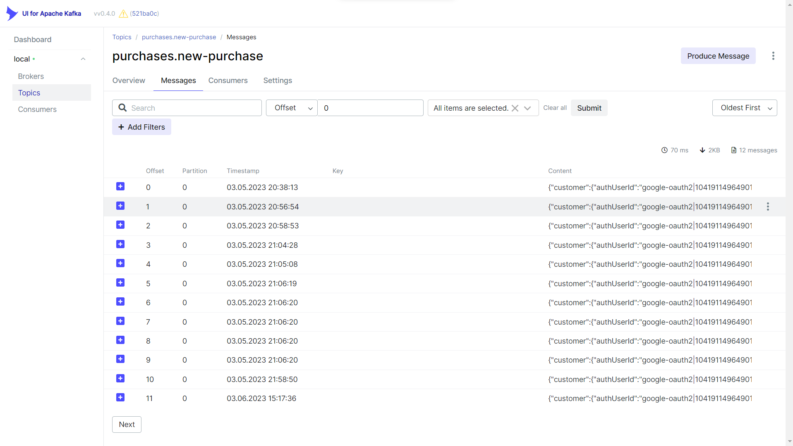

building classroom microservices and purchases

## 🔨 Features

### Service purchases

- [Admin] Register products
- [Admin] List products

- [Auth] List purchases

- [Public] Purchase of one product
- [Public] List products available to purchase

### Service classroom

- [Admin] List enrolments
- [Admin] List students
- [Admin] List courses
- [Admin] Register courses

- [Auth] List courses i have access to
- [Auth] Access content of course

## 🚀 Techs & Tools

→ [**Nest.js**](https://nestjs.com/)

→ [**Prisma**](https://www.prisma.io/)

→ [**GraphQL**](https://graphql.org/)

→ [**Apache Kafka**](https://kafka.apache.org/)

→ [**TypeScript**](https://www.typescriptlang.org)

→ [**Docker**](https://www.docker.com/)

## Kafka UI

